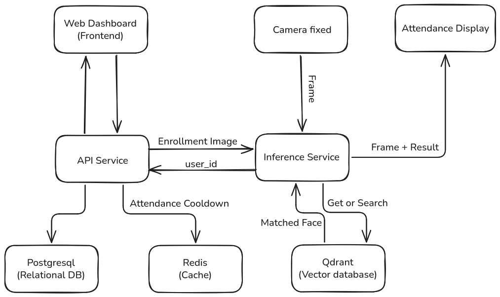
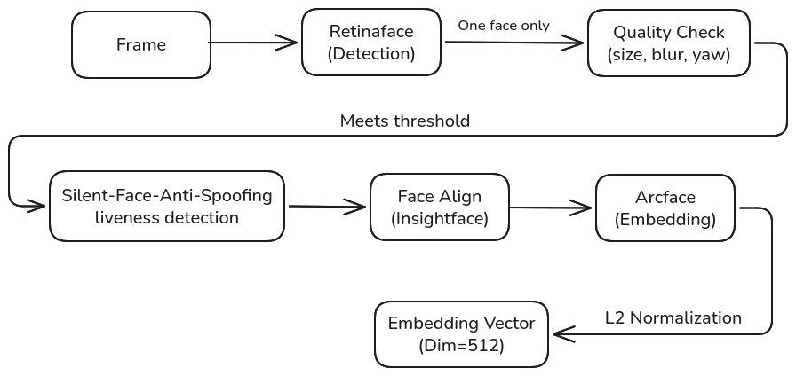

# Face Recognition Attendance System

## 1. Overview

Face Recognition Attendance System là hệ thống điểm danh/chấm công tự động bằng nhận diện khuôn mặt, trong đó `attendance-service` là thành phần chính xử lý luồng AI theo thời gian thực. Service này nhận frame từ camera hoặc MJPEG stream, phát hiện khuôn mặt, kiểm tra chất lượng ảnh, chống giả mạo bằng liveness detection, căn chỉnh khuôn mặt, trích xuất embedding và đối sánh với vector database để xác định nhân viên.

Điểm nổi bật của hệ thống là khả năng xử lý real-time, tích hợp anti-spoofing để giảm rủi ro dùng ảnh hoặc video giả, và kiến trúc distributed gồm AI service, API service, vector database, PostgreSQL/Redis và màn hình hiển thị kết quả điểm danh. Cách tách service này giúp phần nhận diện, lưu trữ nghiệp vụ và giao diện vận hành độc lập hơn, dễ mở rộng và dễ triển khai bằng Docker Compose.

## 2. Link Video Demo.
link: 

## 3. System Architecture


#### Hệ thống được thiết kế theo kiến trúc distributed FastAPI, tách biệt rõ giữa xử lý nghiệp vụ và xử lý AI để mỗi service có thể scale và maintain độc lập:

- API Service: Đóng vai trò trung tâm điều phối — xử lý nghiệp vụ điểm danh, quản lý dữ liệu nhân viên/ca làm, phục vụ Web Dashboard, và gửi ảnh enrollment sang Inference Service khi có nhân viên mới đăng ký khuôn mặt.

- Inference Service: Chuyên trách toàn bộ tác vụ AI — nhận diện khuôn mặt, chống giả mạo, trích xuất embedding và tìm kiếm vector trong Qdrant. Tách riêng service này giúp cô lập tải GPU-heavy khỏi các luồng xử lý nghiệp vụ thông thường.

#### Data flow tổng quan:

1. Enrollment: API Service gửi ảnh khuôn mặt nhân viên (Enrollment Image) sang Inference Service để trích xuất embedding và lưu vào Qdrant.
2. Real-time recognition: Camera fixed liên tục gửi Frame tới Inference Service. Service này trích xuất embedding từ khuôn mặt trong frame, gửi truy vấn Get or Search tới Qdrant để tìm khuôn mặt khớp nhất (Matched Face).
3. Sau khi xác định danh tính, Inference Service gửi user_id về API Service để ghi nhận điểm danh — đồng thời kiểm tra Attendance Cooldown qua Redis (tránh ghi trùng) và lưu bản ghi chính thức vào PostgreSQL.
4. Inference Service nhận kết quả chấm công và gửi trực tiếp Frame + Result tới Attendance Display để hiển thị real-time.
5. API Service phục vụ dữ liệu (nhân viên, lịch sử điểm danh...) cho Web Dashboard để quản trị viên theo dõi và quản lý.

## 4. Face Recognition Pipeline


- `attendance-service` xử lý từng frame từ camera stream theo một pipeline nhận diện khuôn mặt. Đầu tiên, hệ thống dùng RetinaFace để phát hiện khuôn mặt trong frame và chỉ tiếp tục khi có đúng một khuôn mặt hợp lệ. Sau đó, ảnh khuôn mặt được kiểm tra chất lượng dựa trên kích thước, độ mờ và góc quay để loại bỏ các frame không đủ tin cậy.

- Nếu khuôn mặt đạt ngưỡng chất lượng, hệ thống chạy Silent-Face-Anti-Spoofing để kiểm tra liveness và giảm rủi ro dùng ảnh/video giả. Khuôn mặt thật sẽ được căn chỉnh bằng InsightFace.utils.face_align.norm_crop, sau đó đưa qua ArcFace để trích xuất embedding 512 chiều. Embedding này được chuẩn hóa bằng L2 Normalization trước khi dùng để so khớp với dữ liệu trong vector database và xác định danh tính nhân viên.

## 5. Tech Stack

| Category | Technologies |
| --- | --- |
| Backend | Python, FastAPI, Uvicorn, Pydantic, SQLAlchemy, Alembic, HTTPX |
| AI/CV | PyTorch CUDA, ONNX Runtime GPU, InsightFace, RetinaFace, ArcFace, Silent-Face-Anti-Spoofing, OpenCV, NumPy, Pillow |
| Database | PostgreSQL, Qdrant Vector Database, Redis |
| Infra | Docker, Docker Compose, NVIDIA Container Runtime, healthcheck-based service orchestration |

## 6. Installation & Setup

### Environment Requirements

- Docker Engine và Docker Compose.
- Python `>=3.10,<3.13` nếu muốn chạy service ở local mode.
- NVIDIA GPU, NVIDIA Driver và NVIDIA Container Runtime nếu muốn chạy `attendance-service` bằng GPU.
- Camera/IP camera/MJPEG stream hoặc fake camera stream để test luồng nhận diện realtime.

### Setup Steps

1. Clone repository:

```bash
git clone <repository-url>
cd Face-Recognition-Attendance-System
```

2. Tạo file môi trường cho từng service:

Tạo thủ công `api-service/.env` và `attendance-service/.env` dựa trên các biến trong `docker-compose.yml`. Các biến quan trọng gồm database/Redis URL, API key giữa hai service, đường dẫn model weights, Qdrant URL và `STREAM_URL`.

3. Build và chạy toàn bộ service:

```bash
docker compose up --build -d
```

Sau khi chạy thành công, các service chính sẽ có địa chỉ:

| Service | URL |
| --- | --- |
| API Service | `http://localhost:8000` |
| Attendance Service | `http://localhost:8001` |
| Qdrant | `http://localhost:6333` |
| PostgreSQL | `localhost:5433` |
| Redis | `localhost:6379` |

4. Chạy database migration:

```bash
docker compose exec api-service alembic upgrade head
```

5. Seed admin account:

API Service có bootstrap admin tự động khi khởi động nếu `BOOTSTRAP_ADMIN_ENABLED=True` trong `api-service/.env`. Cấu hình các biến sau trước khi chạy service:

```env
BOOTSTRAP_ADMIN_EMAIL=admin@example.com
BOOTSTRAP_ADMIN_PASSWORD=Admin12345
BOOTSTRAP_ADMIN_FULL_NAME=System Administrator
```

6. Test camera stream nếu chạy realtime attendance:

```bash
python tool/fake_camera_server.py
```

Sau đó cấu hình `STREAM_URL` cho `attendance-service` trỏ tới stream, ví dụ khi chạy trong Docker Compose:

```env
STREAM_URL=http://host.docker.internal:8080/stream
```

7. Kiểm tra service health:

```bash
curl http://localhost:8000/health
curl http://localhost:8001/health
```


